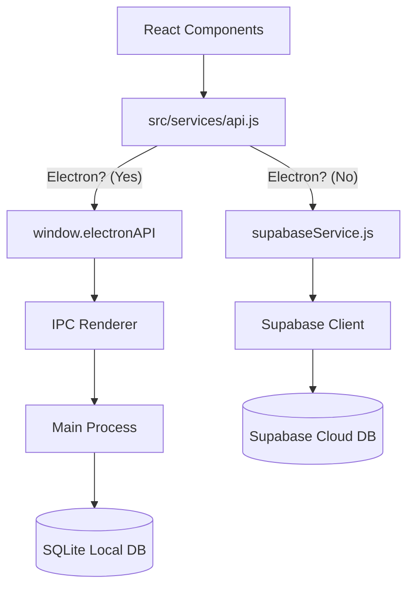

# Backend Connection & Data Flow

This project implements a **Hybrid Architecture** that switches between a local database (for the Desktop/Electron app) and a cloud database (for the Web version).

## 🔀 Central API Layer (`src/services/api.js`)

The frontend application does not connect directly to the database in components. Instead, it uses a unified API layer that determines which data source to use based on the environment.

**Key Logic:**
-   Checks if the app is running in **Electron** (Desktop) or **Browser** (Web).
-   Routes requests accordingly.

```javascript
// src/services/api.js

const isElectron = () => window.electronAPI !== undefined;

const api = {
    users: {
        getAll: async () => {
            if (isElectron()) {
                // Desktop Mode: database is local
                return await window.electronAPI.users.getAll();
            } else {
                // Web Mode: database is in the cloud (Supabase)
                return await supabaseService.getAllUsers();
            }
        },
        // ... other methods
    }
};
```

---

## 🖥️ Desktop Mode (Electron)

When running as a desktop application, the data is stored locally on the user's machine using **SQLite**.

### **Data Flow:**
1.  **Frontend Component**: Calls `api.users.getAll()`.
2.  **API Layer**: Detects Electron -> Calls `window.electronAPI.users.getAll()`.
3.  **Preload Script** (`electron/preload.cjs`): Uses `ipcRenderer` to send a message to the main process.
    ```javascript
    contextBridge.exposeInMainWorld('electronAPI', {
        users: { getAll: () => ipcRenderer.invoke('users:getAll') }
    });
    ```
4.  **Main Process** (`electron/main.cjs`): Listens for the message and calls the local database controller.
    ```javascript
    ipcMain.handle('users:getAll', async () => {
        return db.getAllUsers(); // Calls local SQLite database
    });
    ```
5.  **Local Database**: (`electron/database.cjs`) Executes SQL query via `better-sqlite3`.

---

## wd️ Web Mode (Browser)

When running in a web browser, the data is stored in **Supabase** (PostgreSQL).

### **Data Flow:**
1.  **Frontend Component**: Calls `api.users.getAll()`.
2.  **API Layer**: Detects Browser -> Calls `supabaseService.getAllUsers()`.
3.  **Supabase Service** (`src/services/supabaseService.js`): Uses the Supabase client library.
    ```javascript
    async getAllUsers() {
        const { data, error } = await this.supabase
            .from('users')
            .select('*');
        return data;
    }
    ```
4.  **Supabase Client** (`src/services/supabaseConfig.js`): Connects to the hosted Supabase PostgreSQL database via REST/WebSocket.

---

## 🔐 Connection Configuration

### **Supabase (Web)**
Authentication and connection details are stored in `src/services/supabaseConfig.js`.
-   **URL**: `https://fcapcibgcwfehvvwjfre.supabase.co`
-   **Key**: `supabaseAnonKey` (Public generic key)

### **SQLite (Desktop)**
Database file is located in the user's application data directory:
-   **Path**: `userData/hardware-shop.db`
-   Managed by `electron/database.cjs`.

## Summary Diagram


